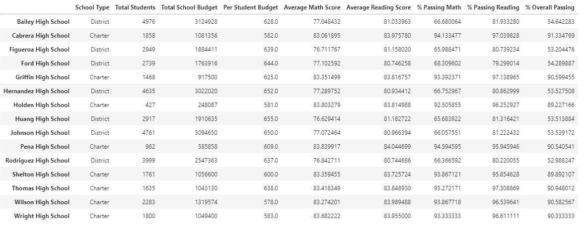

# An Analysis of School District
## Overview
Maria is the Chief Data Scientist who prepares standardized tast data for analysis, reporting and performance trends.  She is responsible for analyzing data of funding and standardized test scores.  After our original analysis was provided, the school board discovered that the orignal .csv file might have been altered. 
### Purpose
Initially, we were asked to aggregate the data and showcase trends and school performances for the School Board/Superintendent to use in setting school budgets and priorities.  Now, we have been asked to replace the math and reading scores for the ninth grade at Thomas High School with NaNs while keeping the rest of the data intact, then repeat our analysis and report on how these changes affected the overall analysis.  This included tables with the following metric(s):
* District summary
* School summary
* Top five (5) performing schools based on overall passing rates
* Bottom five (5) performing schools based on overall passing rates
* Average math scores and percentages by student in each grade at each school
* Average reading scores and percentages by student in each grade at each school
* School performance based on budget per student
* School performance based on school size
* School performance based on school type
## Resources
Data:  .csv files:  students_complete, schools_complete, clean_students_complete, missing_grades 
Software(s):  Python 3.7, Jupyter Lab 3.0.14, Pandas, NumPy
## Results 
NOTE:  In each section, the first screenshot is the original analysis (Original) and the second is after removal of the ninth grade at Thomas High School (Amended).

* How is the district summary affected? 
(Original)

(Amended)

As shown above, the average math score dropped 0.10, which effectively had no change in the analysis results for the district.

* How is the school summary affected? 
(Original)

(Amended)

As shown above, only the Thomas High School results were affected.  Although the average reading score increased by 0.047, all other statistics were reduced by less than 0.10, again effectively having no change in the analysis results for the schools.

* How does replacing the ninth graders’ math and reading scores affect Thomas High School’s performance relative to the other schools?
  
* How does replacing the ninth-grade scores affect the following: 
  * Math and reading scores by grade 
    (Original - Math) 
     
    (Amended - Math) 
     
    (Original - Reading) 
     
    (Amended - Reading) 
     
    As shown above, the only change for both the math and reading scores for the 9th grade at Thomas High School is the original scores are replaced with NaN.
        
  * Scores by school spending 
    (Original) 
     
    (Amended) 
     
    
  * Scores by school size 
    (Original) 
     
    (Amended) 
     
    
  * Scores by school type 
    (Original) 
     
    (Amended) 
     

## Summary
We have summarized the following changes in the updated analysis after the reading and math scores for the ninth grade at Thomas High School were replaced with NaNs. 
1)
2)
3)
4)

